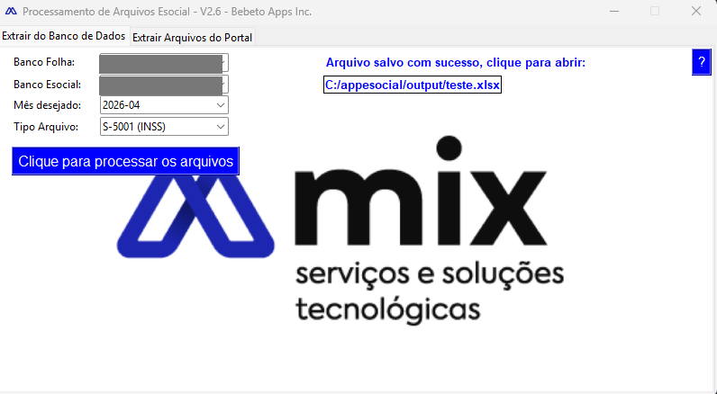
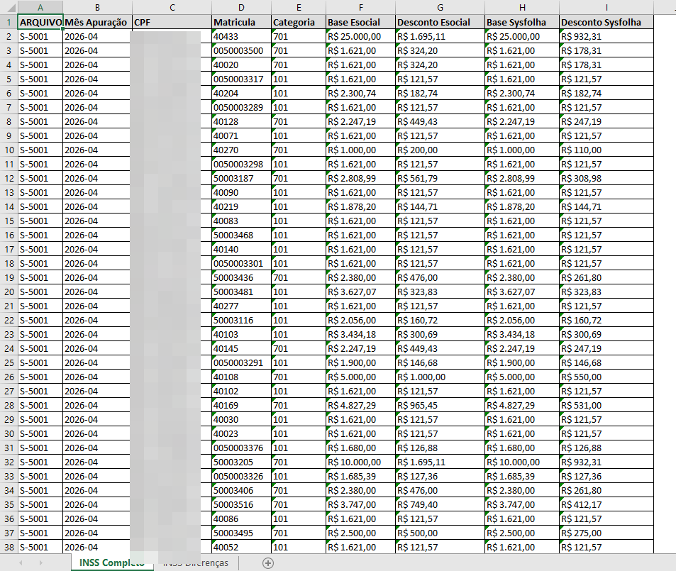
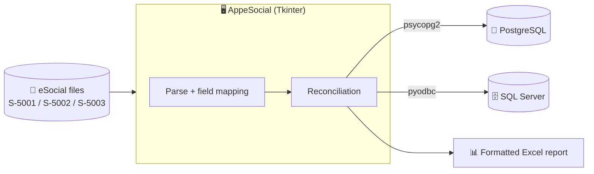

# 🧾 AppeSocial — eSocial Processor & Reconciler

**Desktop tax/payroll tool** · Parses Brazilian eSocial files · Reconciles against two databases · In production

A desktop app that processes Brazilian **eSocial** files (tax/payroll events **S-5001 / INSS**,
**S-5002 / IRRF**, **S-5003 / FGTS**), reconciles their amounts against corporate databases, and exports a
formatted **Excel** report ready for review.

> **Note on source code.** This repository is a **public showcase** of a commercial product.
> The full source is private; this README documents the architecture and engineering decisions.
> No real data is included here. Code walkthrough available on request.

---

## 📸 Screenshots

| Main window | Excel output (reconciliation) |
|---|---|
|  |  |

---

## ✨ What it does

Manually checking eSocial event amounts (payroll and taxes) against the company's own system is repetitive
work where discrepancies are easy to miss. This tool automates it:

- 📑 **Parses eSocial events** — reads the official files for INSS (S-5001), IRRF (S-5002) and FGTS (S-5003).
- 🗺️ **Field mapping** — each event's fields are described in mapping dictionaries, isolating the eSocial
  layout rules from the rest of the code.
- 🔗 **Two-database reconciliation** — pulls the matching values from **PostgreSQL** and **SQL Server** in
  the same operation, so the eSocial figures can be checked against the source of truth.
- 📊 **Formatted Excel export** — produces a review-ready spreadsheet (styling, columns) for the analyst.
- 📈 **Progress feedback** — a progress bar keeps the user informed during long extractions.
- 🧩 **Single executable** — packaged with bundled resources (icon, background) to run as one app.

---

## 🏗️ Architecture

---

## 🧰 Tech stack

| Concern | Technology |
|---|---|
| **UI** | Python · Tkinter · Pillow (assets) · easygui (dialogs) |
| **Parsing** | `xml.etree.ElementTree` + per-event mapping dictionaries |
| **Databases** | PostgreSQL (`psycopg2`) · SQL Server (`pyodbc`) — used together |
| **Reporting** | `openpyxl` (formatted Excel) |
| **Packaging** | PyInstaller → single `.exe` with embedded resources |

---

## 🔒 Engineering highlights

- **Layout rules, isolated.** Each eSocial event type has its own mapping dictionary, so a change in the
  government layout is a localized edit — not a hunt across the codebase.
- **Multi-source reconciliation.** Reconciling values that come from two different database engines in a
  single pass is the core of the tool — it's what turns "two systems that should agree" into a confident,
  reviewable report.
- **Built for the reviewer's workflow.** The output isn't raw data — it's a formatted Excel designed around
  how an analyst actually checks the numbers.
- **Self-contained distribution.** Ships as a single executable with bundled assets, so non-technical users
  just open it — no Python, no setup.

---

## 👤 Author

**Carlos Alberto C. de Azevedo Filho** — Software Developer
🌐 [patoxzor.github.io](https://patoxzor.github.io) · 💼 [LinkedIn](https://www.linkedin.com/in/azevedoocarlos/) · 🐙 [GitHub](https://github.com/Patoxzor)
